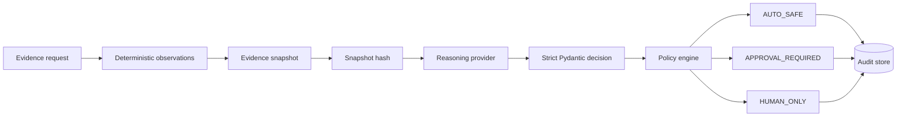

# Controlled AI Decision Pipeline


A small applied-AI engineering demonstration: model reasoning is constrained by typed evidence, deterministic observations, strict schemas, explicit limitations, provenance, and a separate authority policy.

## Why this exists

AI integrations become hard to trust when model output is treated as fact or authority. This repository separates evidence, deterministic facts, reasoning, policy, authority, and approval so a provider can recommend without controlling execution.

It demonstrates evidence-grounded reasoning, schema validation, provenance, confidence/evidence separation, human approval gating, deterministic policy boundaries, and failure-safe workflows.

## Architecture



## Control invariants

- Providers never grant authority or execute actions.
- Deterministic observations are part of the hashed snapshot and remain unchanged.
- Every response is linked to a canonical evidence snapshot hash.
- Weak, missing, or conflicting evidence cannot produce `AUTO_SAFE`.
- Invalid provider output and provider errors become audited, non-actionable `NOT_ANALYZED` results.
- `APPROVAL_REQUIRED` stays blocked until one approval transition is recorded; `HUMAN_ONLY` cannot be approved into automatic authority.
- The default mock provider, API, and tests run offline.

## 60-second demo

```sh
git clone https://github.com/vantablade-ai/controlled-ai-decision-pipeline.git
cd controlled-ai-decision-pipeline
make install
make demo
```

The demo uses a temporary SQLite database and needs no API key or network.

## Decision schema

Each decision includes status, confidence, evidence quality, rationale, evidence references, limitations, conflicts, missing information, recommended action, actionability, authority mode, provider metadata, snapshot hash, and approval state. Core fields use explicit enums and Pydantic validation.

## Evidence quality vs confidence

Confidence describes the provider's certainty about its reasoning. Evidence quality describes the completeness and strength of the underlying inputs. The deterministic policy caps provider quality claims; high confidence cannot compensate for missing or conflicting evidence.

## Authority policy and human approval

`AUTO_SAFE` is limited to harmless synthetic actions such as logging an observation, creating a review ticket, or queuing follow-up analysis. Partial evidence can reach `APPROVAL_REQUIRED` at most. Other action classes remain `HUMAN_ONLY`. Approval-required records start pending and can transition once to approved or rejected, with a reviewer label and timestamp.

## Provenance and provider interface

Normalized evidence and deterministic observations are canonicalized and hashed with SHA-256. SQLite retains the snapshot, observations, validated provider output, final decision, and approval data. `MockProvider` is the default. An optional OpenAI adapter can be enabled with `PROVIDER=openai` and `OPENAI_API_KEY`; install its dependency with `pip install -r requirements-openai.txt`. It requests JSON Schema output and still validates locally.

## Offline mode and API

```sh
make run
```

Endpoints: `POST /decisions`, `GET /decisions`, `GET /decisions/{id}`, approval/rejection endpoints, and `GET /health`. FastAPI docs are at `/docs`. Configure `DATABASE_PATH` and `PROVIDER` with environment variables.

## Testing and repository structure

```sh
make test
make check
```

`app/core` contains observations, snapshots, and policy; `app/providers` contains mock and optional OpenAI adapters; `app/repositories` persists audit records; `app/services` composes the bounded flow. Examples and a runnable demo are provided.

## Engineering decisions and limitations

The design favors inspectable deterministic gates and small typed models over orchestration frameworks. This project demonstrates applied AI engineering, structured LLM workflows, evidence grounding, schema validation, provenance, confidence/evidence separation, approval gating, deterministic policy boundaries, and failure-safe reasoning.

It does not demonstrate model training, fine-tuning, data science, unrestricted autonomous agents, factual correctness guarantees, production-scale distributed infrastructure, or replacement of human judgment. It has no authentication or verified evidence-source identity; reviewer labels are synthetic, and provider claims may still be wrong.
